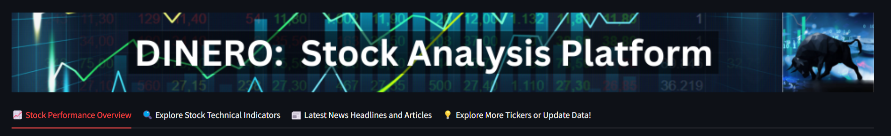
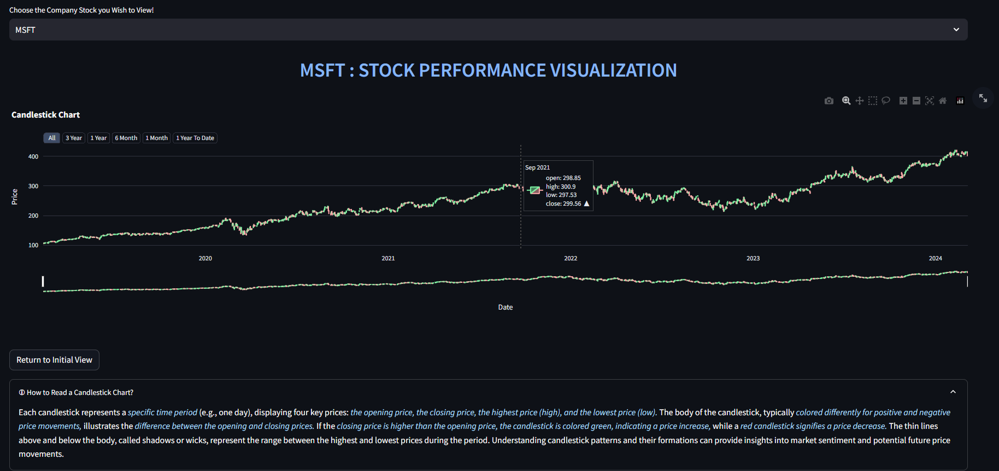
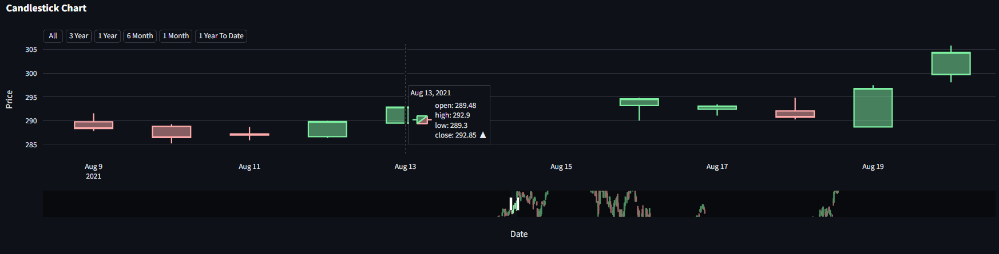
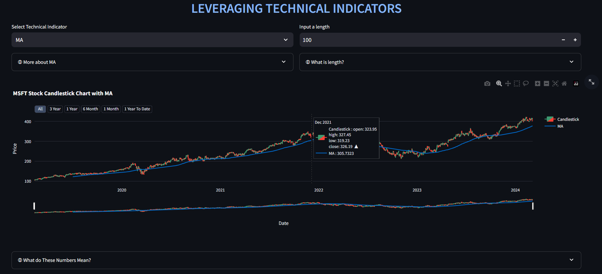
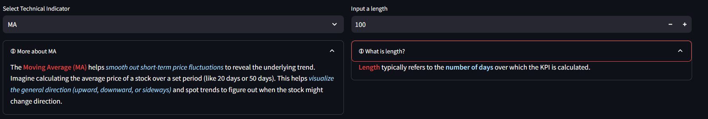
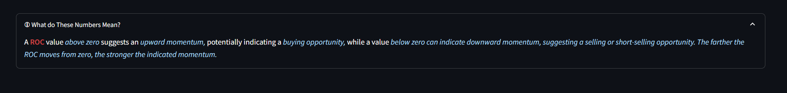
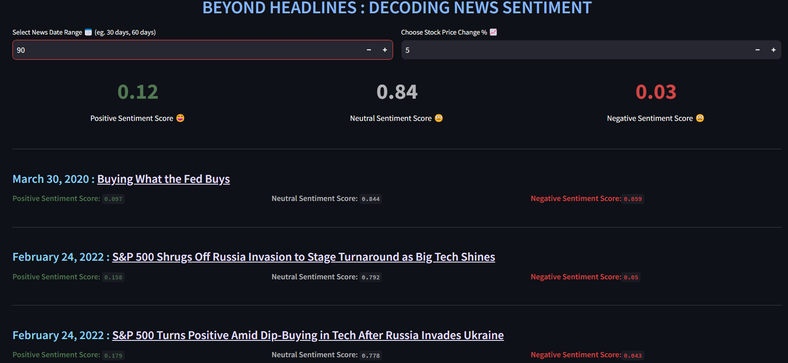
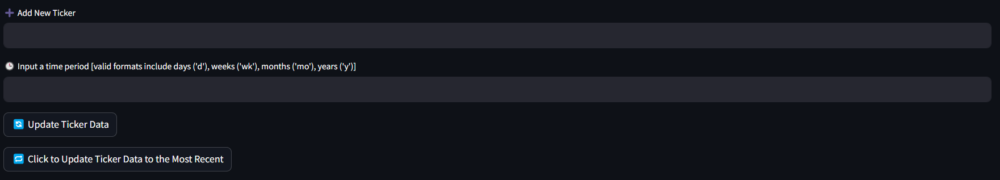
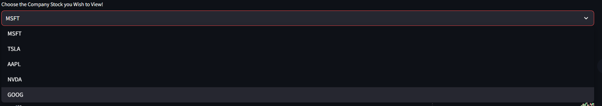
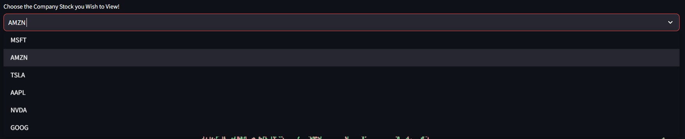

# Stock Analysis Tool Guide
Welcome to the Stock Analysis Tool! This guide will walk you through the different functionalities and features of our application.

## Getting Started
Upon launching the app, you'll encounter four tabs, each offering a distinct set of features and tools. Below is an overview of the tabs:

1. 📈 Stock Performance Overview
2. 🔍 Explore Stock Technical Indicators
3. 📰 Latest News Headlines and Articles
4. 💡 Explore More Tickers or Update Data!

# Tab 1: Stock Performance Overview
In this tab, users can explore the performance of different stocks through candlestick charts. Here's what you can do:

1. Choose a company from the select box.
2. View candlestick chart displaying stock open, low, high, and closing prices.
3. Select time period ranging from entire data to specific durations.
4. Hover over the candles to see tooltips displaying the open, low, high, and closing prices for each period.

**For Beginners:** Unsure how to read a candlestick chart? Click the expander button below for a helpful guide!

You can also zoom into the candlestick chart for a closer look into the indivdiual box plots. Zoom in on the chart using your mouse's scroll wheel for a closer look at specific patterns.

# Tab 2: Explore Stock Technical Indicators
This tab offers various technical indicators for analyzing stock prices. Here are the indicators available:

1. Moving Average (MA)
2. Relative Strength Index (RSI)
3. Rate of Change (ROC)
4. Bollinger Bands Percentage (BBP)

Again, to facilitate, engage and inform users who are unfamiliar with financial terms, we aim to explain the technical terms. Click the expander buttons next to each indicator to access detailed explanations. These expanders explain what "length" (a common parameter) means and provide additional information about the specific indicator.

# Tab 3: Latest News Headlines and Articles
Stay informed about news events that might impact stock prices.
View the sentiment analysis for each news story, categorized as positive, negative, or neutral (with values ranging from 0 to 1).

1. Select a date range to filter the news based on how recent you want the information to be.
2. Analyze news articles based on their corresponding percentage change in stock price. For example, you can see news related to a 5% price drop or a 10% price increase.

Each news story displays its individual sentiment score and provides a link to the original article for further reading.

# Tab 4 : Explore More Tickers or Update Data!
This tab allows you to expand your analysis or update existing data:

1. Enter the ticker symbol of a new company you'd like to analyze.
2. Optionally, specify the time period for which you want to retrieve data (e.g., 3 months, 4 days).
3. Click on the "🔄 Update Ticker Data"

To refresh data for a company you've already analyzed, simply click the  "🔁 Click to Update Ticker Data to the Most Recent" button This ensures you have the latest information available.

The follwoing two images show that a new company stock has been added for you to visualize and analyze!
The images below demonstrate adding a new company stock for visualization and analysis:

We hope this guide empowers you to effectively utilize our app for insightful stock analysis!
